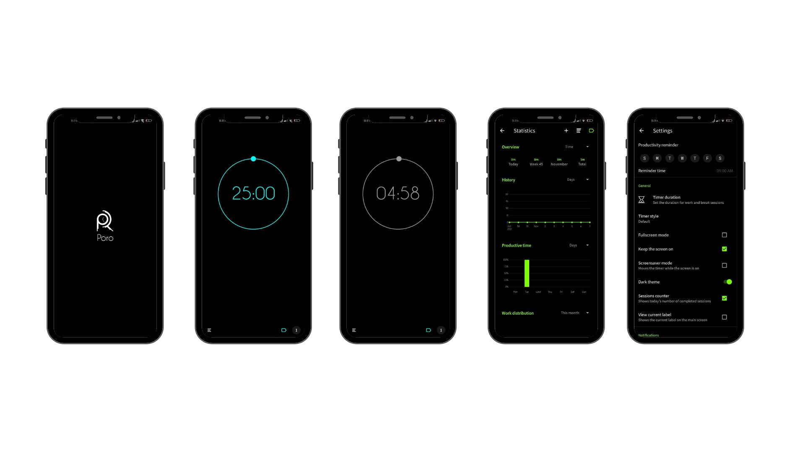

# Poro
Its build-in Android Kotlin
### Some Screenshots

  

## Function
* Track time work and time break.
* Habit analysis and display chart.
* Alarm.
* Custom your habit.
* Dark theme and Light Theme.
* Run in background

## In App

## Download
You can [download](resources/poro.apk) the latest installable version of Crypto Currency for Android.

Le Tran Hoang Son aka Daniel